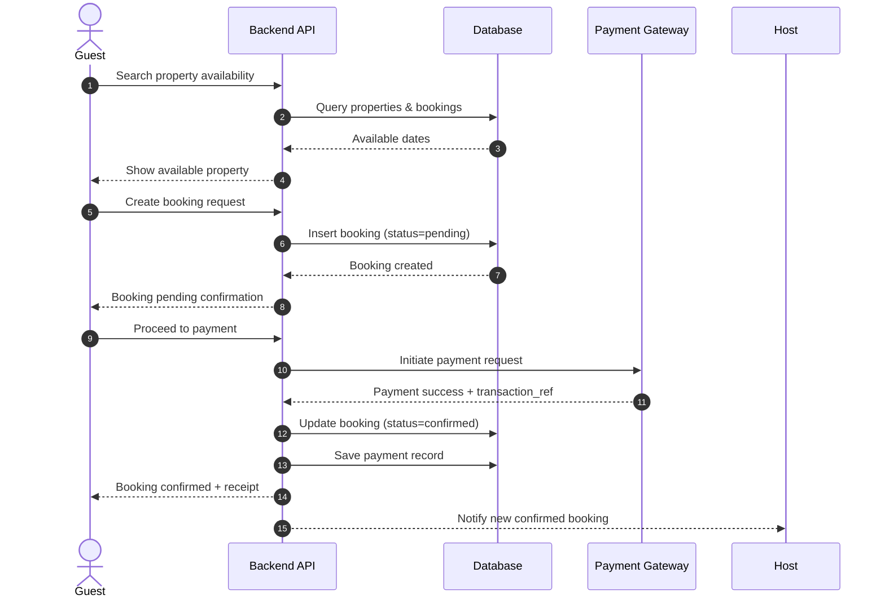
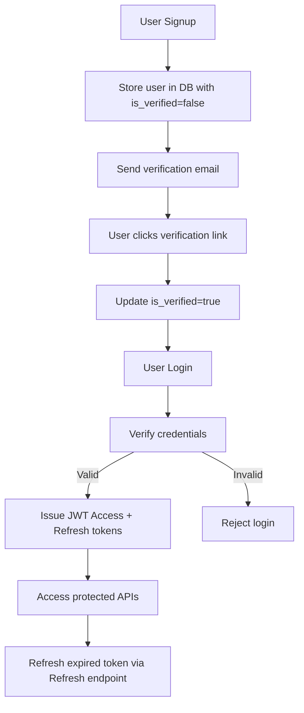

# Airbnb Clone – Backend

A robust, scalable backend for an Airbnb-style marketplace that manages users, property listings, bookings, payments, and reviews. Built for correctness, performance, and developer velocity.

---

## 📑 Contents

* [🚀 Objective](#-objective)
* [🏆 Project Goals](#-project-goals)
* [🛠️ Features Overview](#️-features-overview)
* [⚙️ Technology Stack](#️-technology-stack)
* [👥 Team Roles](#-team-roles)
* [📈 API Documentation Overview](#-api-documentation-overview)
* [🗃️ Database Design](#️-database-design)
* [🔩 Feature Breakdown](#-feature-breakdown)
* [🔐 API Security](#-api-security)
* [🚢 CI/CD Pipeline](#-cicd-pipeline)
* [📚 Technology Stack (Details)](#-technology-stack-details)

---

## 🚀 Objective

Provide a solid foundation for **user interactions, property listings, bookings, payments, and reviews**, exposing clean REST and GraphQL APIs.  
The system is designed for **performance, scalability, and security**, with full support for CI/CD pipelines, observability, and developer productivity.

---

## 🏆 Project Goals

* **User Management**: Secure registration, authentication, and profile management  
* **Property Management**: Create, update, search, and retrieve property listings  
* **Booking System**: Reserve properties with availability checks and lifecycle management  
* **Payment Processing**: Process and record transactions safely and idempotently  
* **Review System**: Post moderated reviews and ratings  
* **Data Optimization**: Support fast reads via indexing, caching, and pagination  

---

## 🛠️ Features Overview

### 1) API Documentation
* **OpenAPI/Swagger**: REST endpoints with schemas for all resources  
* **Django REST Framework (DRF)**: CRUD endpoints, authentication, pagination, throttling  
* **GraphQL**: Flexible schema for complex client data fetching  

### 2) User Authentication
* **Endpoints**: `/users/`, `/users/{id}/`  
* **Features**: Sign-up, login, JWT issuance/refresh, profile CRUD  

### 3) Property Management
* **Endpoints**: `/properties/`, `/properties/{id}/`  
* **Features**: CRUD operations, search, filtering (price, location, amenities), availability  

### 4) Booking System
* **Endpoints**: `/bookings/`, `/bookings/{id}/`  
* **Features**: Create, modify, cancel bookings; check-in/out; prevent overlapping reservations  

### 5) Payment Processing
* **Endpoints**: `/payments/`  
* **Features**: Capture, confirm, refund; webhook handling; idempotency guarantees  

### 6) Review System
* **Endpoints**: `/reviews/`, `/reviews/{id}/`  
* **Features**: Post/edit/delete reviews; aggregate ratings; moderation flags  

### 7) Database Optimizations
* **Indexing**: Emails, host IDs, booking dates  
* **Caching**: Redis for hot listings, search results, aggregates  
* **Constraints**: Exclusion constraints for non-overlapping bookings  

---

## ⚙️ Technology Stack

* **Django** – Web framework and ORM  
* **Django REST Framework (DRF)** – REST API with serializers, auth, pagination  
* **GraphQL** – Flexible queries and mutations for mobile/web apps  
* **PostgreSQL** – Relational DB with JSONB, GIST/GIN indices  
* **Celery** – Asynchronous jobs (emails, payments, webhooks)  
* **Redis** – Cache, broker, rate-limiter  
* **Docker** – Containerization and environment parity  
* **CI/CD Pipelines** – Automated build, test, deployment with GitHub Actions  

---

## 👥 Team Roles

* **Backend Developer** – Designs domain models; builds REST/GraphQL endpoints; writes business logic and tests  
* **Database Administrator (DBA)** – Manages schemas, indexes, constraints, backups, and performance tuning  
* **DevOps Engineer** – Sets up CI/CD, infrastructure, scaling, monitoring, secret management  
* **QA Engineer** – Automated and manual testing, regression suites, performance/load tests  
* **Project Manager** – Coordinates tasks, manages timelines, risk mitigation  
* **Security Engineer (optional)** – Threat modeling, vulnerability scans, incident response  

---

## 📈 API Documentation Overview

**REST Endpoints**

**Users**
- `GET /users/` – List users  
- `POST /users/` – Create user  
- `GET /users/{id}/` – Retrieve user  
- `PUT /users/{id}/` – Update user  
- `DELETE /users/{id}/` – Delete user  

**Properties**
- `GET /properties/` – List properties  
- `POST /properties/` – Create property  
- `GET /properties/{id}/` – Retrieve property  
- `PUT /properties/{id}/` – Update property  
- `DELETE /properties/{id}/` – Delete property  

**Bookings**
- `GET /bookings/` – List bookings  
- `POST /bookings/` – Create booking  
- `GET /bookings/{id}/` – Retrieve booking  
- `PUT /bookings/{id}/` – Update booking  
- `DELETE /bookings/{id}/` – Delete booking  

**Payments**
- `POST /payments/` – Process payment  

**Reviews**
- `GET /reviews/` – List reviews  
- `POST /reviews/` – Create review  
- `GET /reviews/{id}/` – Retrieve review  
- `PUT /reviews/{id}/` – Update review  
- `DELETE /reviews/{id}/` – Delete review  

---

## 🗃️ Database Design

### Core Entities

**User**
* `id` (UUID, PK)  
* `email` (unique), `password_hash`  
* `first_name`, `last_name`, `phone`  
* `role` (guest | host | admin)  
* `is_verified`, `created_at`, `updated_at`  

**Property**
* `id` (UUID, PK), `host_id` (FK → User)  
* `title`, `description`, `type` (entire | private_room | shared_room)  
* `address`, `city`, `country`, `location` (PostGIS point)  
* `amenities` (JSONB), `photos` (JSONB array)  
* `price_per_night`, `currency`, `max_guests`  
* `status` (active | paused | drafted)  

**Booking**
* `id` (UUID, PK), `property_id` (FK), `guest_id` (FK → User)  
* `start_date`, `end_date`, `guests_count`  
* `total_amount`, `currency`, `status` (pending | confirmed | cancelled)  
* `created_at`  

**Payment**
* `id` (UUID, PK), `booking_id` (FK)  
* `provider`, `amount`, `currency`  
* `status` (succeeded | failed | refunded)  
* `transaction_ref`, `paid_at`  

**Review**
* `id` (UUID, PK), `property_id` (FK), `author_id` (FK → User), `booking_id` (FK)  
* `rating` (1–5), `comment`, `is_public`, `created_at`  

---

### Entity Relationship (ER)

```mermaid
erDiagram
    USER {
        UUID id PK
        string email
        string password_hash
        string first_name
        string last_name
        string phone
        string role
        boolean is_verified
        timestamp created_at
        timestamp updated_at
    }

    PROPERTY {
        UUID id PK
        UUID host_id FK
        string title
        string description
        string type
        string address
        string city
        string country
        point location
        jsonb amenities
        jsonb photos
        numeric price_per_night
        string currency
        int max_guests
        string status
    }

    BOOKING {
        UUID id PK
        UUID property_id FK
        UUID guest_id FK
        date start_date
        date end_date
        int guests_count
        numeric total_amount
        string currency
        string status
        timestamp created_at
    }

    PAYMENT {
        UUID id PK
        UUID booking_id FK
        string provider
        numeric amount
        string currency
        string status
        string transaction_ref
        timestamp paid_at
    }

    REVIEW {
        UUID id PK
        UUID property_id FK
        UUID author_id FK
        UUID booking_id FK
        int rating
        string comment
        boolean is_public
        timestamp created_at
    }

    USER ||--o{ PROPERTY : hosts
    USER ||--o{ BOOKING : makes
    PROPERTY ||--o{ BOOKING : has
    BOOKING ||--|| PAYMENT : includes
    PROPERTY ||--o{ REVIEW : receives
    USER ||--o{ REVIEW : writes
    BOOKING ||--o{ REVIEW : relates_to (post-stay)
```
---

### Booking & Payment Flow


---

### User Authentication Flow


---

### Relationships
* A **User(host)** → **Properties** (1-N)  
* A **Property** → **Bookings** (1-N)  
* A **User(guest)** → **Bookings** (1-N)  
* A **Booking** → **Payment** (1-1)  
* A **Property** → **Reviews** (1-N, tied to completed bookings)

---

### Indexes & Constraints
* Unique index on `users.email`  
* Composite index `(property_id, start_date, end_date)`  
* GIST index on `properties.location` for geo search  
* Exclusion constraint to prevent overlapping bookings  

---

## 🔩 Feature Breakdown

* **User Management** – Sign-up/login with JWT, email verification, password reset, profile edit  
* **Property Management** – Hosts manage listings, photos, pricing, availability; users browse with filters  
* **Booking System** – Availability checks, cancellation policies, notifications  
* **Payment Processing** – Idempotent charges, refunds, webhook verification  
* **Reviews** – Ratings/comments tied to stays; moderation tools  
* **Admin Ops** – Dashboards for moderation, disputes, refunds, and reporting  

---

## 🔐 API Security

* **Authentication** – JWT tokens; optional OAuth login  
* **Authorization** – Role-based access control; object-level permissions  
* **Input Validation** – Serializer checks; sanitized inputs; strict file upload rules  
* **Rate Limiting** – Throttling via Redis + DRF  
* **Transport Security** – HTTPS, HSTS, secure cookies  
* **Secrets Management** – Environment variables, secret rotation  
* **Payment Safety** – Idempotency keys, webhook signature verification, PCI compliance  
* **Audit & Monitoring** – Logs with trace IDs, anomaly alerts  
* **CORS/CSRF** – Strict CORS; CSRF protection where relevant  

---

## 🚢 CI/CD Pipeline

* **CI** – On PRs: linting, type checks, unit/integration tests, Docker build, OpenAPI schema generation  
* **CD** – On main: push Docker image, run DB migrations, deploy to staging → production with health checks and rollback  
* **Tools** – GitHub Actions, Docker, docker-compose, PostgreSQL, Redis, Celery  
* **Quality Gates** – Status checks, dependency scans (pip-audit, trivy), secret scanning, pinned versions  

---

## 📚 Technology Stack (Details)

* **Django** – Routing, ORM, auth; environment-specific configs (dev/stage/prod)  
* **DRF** – Serializers, ViewSets, Routers, filtering, pagination, throttling  
* **GraphQL (Graphene/Strawberry)** – Schema with stitched resolvers  
* **PostgreSQL** – FK constraints, JSONB fields, migrations tracked in VCS  
* **Celery + Redis** – Background jobs (emails, webhooks, image processing), retries with exponential backoff  
* **Docker** – Reproducible local/prod builds; one-command setup  

---

